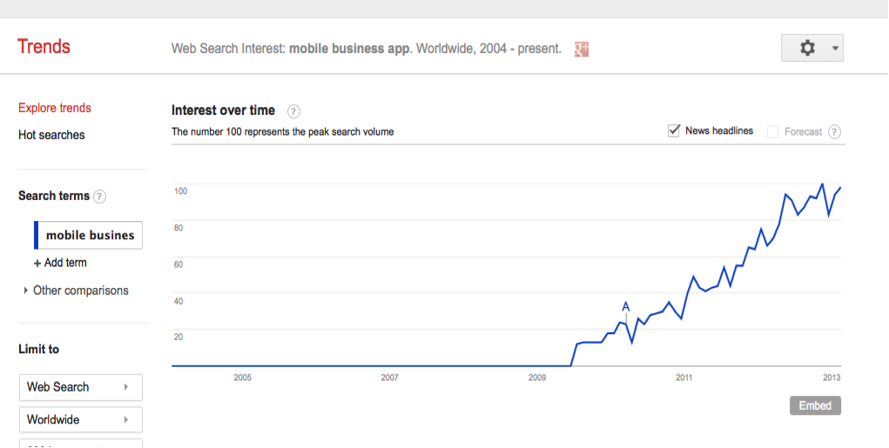
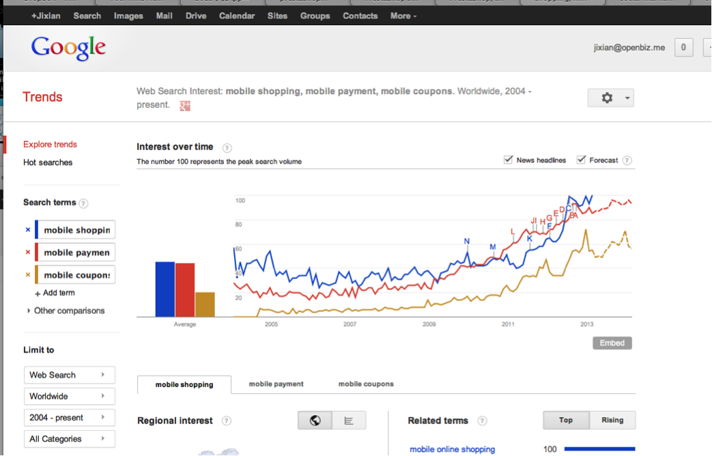

===================
项目发起背景
===================

项目发起背景介绍
-----------------
本项目发起于2013年03月，我们从大约3各月前开始调研大量的市场数据，发现移动商业应用将是2013年的新热点，并将持续火热3-5年。 其中与手机应用相关的特性如下：

* 手机支付 Mobile Payment
* 手机优惠券 Mobile Coupon
* 手机购物 Mobile Shopping
* 社交化推广 Social Marketing

市场分析
-----------
"商业"手机应用
^^^^^^^^^^^^^^^^^^^^^
手机的商业应用需求将成为最近几年的成长趋势。

相比2011年以前的状态手机商业没有清晰的商业赢利模式，最初只能依存广告、游戏、来实现主要APP的收费，但随着手机支付领域的成熟完善，将会有更多的APP用于实现更直接的商业目的，例如 团购、手机淘宝、H&M 和 Zara 、Nike 的手机商城APP。

为什么要强调“购”
^^^^^^^^^^^^^^^^
如同互联网的发展一样，我们可以通过web实现很多种应用，例如 wordpress博客、magento、ecshop商城、DedeCMS建站、B/S的办公系统、Discuz论坛、Blog、团购。 但是就整个互联网web的发展历史来看，同样经过类似手机的发展时期，互联网发展之初同样是没有成熟的商业化模式，同样只有游戏和广告先行，所以各类项目都容易转来人气但是很难变成现金。直到淘宝支付宝拉动了线上付款模式 Magento这类的网购和今天的团购才得以找到自己的商业化模式。并且其中突出了中心词“购”，这是距离现金流最近的一种模式，所以最先可以实现商业化。而微博、论坛这类应用直到互联网的衰退期也没有遇到明显的商业化可能性，只能寄希望于流露换广告费模式。

假设同样我们的期待每个月收入2万元现金，我们选择商业模式靠流量、或者靠销售办公系统和“购”模式，恐怕只有“购”最容易实现这个快速成长目标。

为什么要强调“手机”应用
^^^^^^^^^^^^^^^^^^^^
2013年以来互联网的重心已经从桌面设备的Web逐步转型到智能手机这种移动终端。你会发现就连自己花在手机上的时间已经远远超于使用笔记本访问互联网了，而且今年你已经几乎不去碰台式机了，你也已经完全习惯没有电视信号的生活了（比较你消耗在Youku和电视机上的时间）。

移动购物将是2013年的上升“消费者行为”趋势，并且将有持续上升的可能性

项目发起人
-----------

吉贤
^^^^^
SmartBizApp项目的发起人，也是 CandyJS 框架 和 Openbiz Framework 的创始人之一。
负责规划本项目的技术和商业架构。

冯圣龙
^^^^^^
经验丰富的开发工程师。每天夜里 **苦逼** 干活儿的家伙儿……

陈璐
^^^^^
设计师，负责让我们的前端漂亮起来